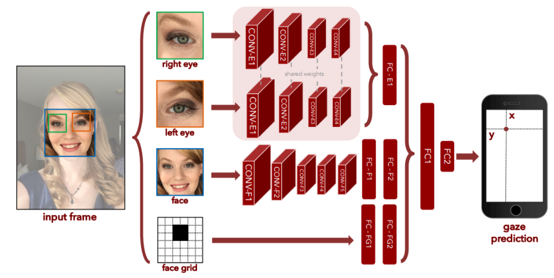

# Eye Tracker
Implemented and improved the iTracker model proposed in the paper [Eye Tracking for Everyone](https://arxiv.org/abs/1606.05814).

*
<h3>Figure 1: iTracker architecture</h3>
*

*
<h3>Figure 2: modified iTracker architecture</h3>
*

Figures 1 and 2 show the architectures of the iTracker model
and the modified model. The only difference between the modified model and the iTracker model is
that we concatenate the face layer FC-F1 and face mask layer FC-FG1 first, after applying a fully connected layer FC-F2,
we then concatenate the eye layer FC-E1 and FC-F2 layer.
We claim that this modified architecture is superior to the iTracker architecture.
Intuitively, concatenating the face mask information together with the eye information
may confuse the model since the face mask information is irrelevant to the eye information.
Even though the iTracker model succeeded to learn this fact from the data,
the modified model outperforms the iTracker model by explictlying encoded with this knowledge.
In experiments, the modified model converged faster (28 epochs vs. 40+ epochs) and achieved better validation
error (2.19 cm vs. 2.514 cm).
The iTracker model was implemented in itracker.py and the modified one was
implemented in itracker_adv.py.
Note that a smaller dataset (i.e., a subset of the full dataset in the original paper) was used in experiments and no data augmentation was applied.
This smaller dataset contains 48,000 training samples and 5,000 validation samples.

# Get started
To train the model: run
`python itracker_adv.py --train -i input_data -sm saved_model`

To test the trained model: run
`python itracker_adv.py -i input_data -lm saved_model`

You can find a pretrained (on the smaller dataset) model under the pretrained_models/itracker_adv/ folder.

# FAQ
1) What are the datasets?

The original dataset comes from the [GazeCapture](http://gazecapture.csail.mit.edu/) project. The dataset involves over 1400 subjects and results in more than 2 million face images. Due to the limitation of computation power, a much [smaller dataset](http://hugochan.net/download/eye_tracker_train_and_val.npz) with 48000 training samples and 5000 validation samples was used here. Each sample contains 5 items: face, left eye, right eye, face mask and labels.

# Other implementations
For pytorch implementations, see [GazeCapture](https://github.com/CSAILVision/GazeCapture).
